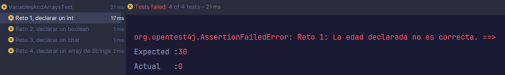

# RetoBit: Colecciones

Tenemos varias tareas a hacer que nos han asignado. En este caso son 3. Todas están relacionadas con colecciones de datos y forman parte del desarrollo de un videojuego.

En este RetoBit verás ejemplos reales del uso de cada una de las colecciones de datos vistas en las lecciones y podrás practicar con sus métodos.

## ¿Qué practicarás?

- ArrayList 
- HashSet
- HashMap
- TDD (Test Driven Development)

## Fork del repositorio:

Haz un fork del repo.

Pulsa el botón Fork en github:


Esto creará una copia del repositorio en tu perfil de Github. 

## Clona el repo en tu computadora

Ahora hay que descargarse el proyecto en tu computadora.

### 1. Asegúrate de que estás en la URL de TU copia del repositorio
   

Si la URL es esta: https://github.com/curso-java-marshall-bits/retobit-colecciones **NO ES CORRECTO**.
    

Donde aparece 'curso-java-marshall-bits' debería aparecer tu nombre de usuario. Haz click en tu perfil y mira tus repositorios para comprobar si hiciste el fork. En caso contrario vuelve al paso anterior. 


### 2. Pulsa en "code" para ver la URL del repositorio y cópiala


Para ello deberás abrir una terminal y navegar a la carpeta donde quieras añadir este retoBit.

Utiliza el siguiente comando:

```commandline
git clone https://aqui.debes.pegar.la.url
```

**Nota: Después del 'git clone' debes pegar la url del repositorio. No pongas la que he puesto yo en el ejemplo 🤣*

Ahora se va a crear un nuevo directorio con el nombre del RetoBit.

### 3. ¡Ya puedes abrir este reto en IntelliJ!

# Instrucciones

Recuerda echar un vistazo al código que tenemos. En este reto, tenemos cada tarea dividida en un **package**. En Java, un package es simplemente una **forma de organizar y agrupar** clases, interfaces y subclases relacionadas.

Los packages son como directorios que nos ayudan a:
- Evitar conflictos de nombres: Dos clases **con el mismo nombre** pueden coexistir si están en diferentes paquetes.

- Facilitar la gestión: Es más fácil encontrar y mantener tu código.

- Controlar la visibilidad: Puedes controlar qué clases pueden acceder a otras dentro o fuera de un paquete.

## Tarea 1: ArrayList, sistema de inventario

Nuestra Tech Lead nos indica que debemos implementar un sistema de inventario usando ArrayList para que los jugadores puedan gestionar objetos (items) en su inventario, con las siguientes operaciones:

- Añadir objetos al inventario.

- Eliminar objetos por nombre.

- Buscar objetos por nombre.

- Calcular el peso total del inventario.

Los métodos son:

    - addItem(Item item):
    Añade el objeto al ArrayList items.

    - removeItem(String itemName):
    Elimina el item cuyo nombre coincida con itemName (usa equals).
    Retorna true si lo eliminó, false si no lo encontró.

    - findItem(String itemName):
    Retorna el primer Item con el nombre buscado (o null si no existe).

    - getTotalWeight():
    Retorna la suma del peso (weight) de todos los items en el inventario.

<details>
  <summary>Pistas 🕵️‍♀️</summary>
Recorrer un ArrayList:
Usa un bucle for o forEach:

````java
for (Item item : items) {
    if (item.getName().equals(itemName)) {
        // Hacer algo...
    }
}
````
Eliminar un elemento:
Usa el método remove() del ArrayList:

````java
items.remove(item);  // Elimina por objeto
````

Sumar pesos:
Acumula el peso en una variable:

````java
double total = 0;
for (Item item : items) {
    total += item.getWeight();
}
return total;
````

</details>

## Tarea 2: HashSet, sistema de habilidades

La segunda tarea que nuestra Tech Lead nos ha asignado es implementar un sistema de habilidades usando HashSet para garantizar que cada personaje aprenda habilidades sin duplicados, con las siguientes funcionalidades:

- Aprender nuevas habilidades

- Verificar si una habilidad ya ha sido aprendida

- Evitar duplicados de habilidades

Los métodos a implementar son:

    - learnSkill(Skill skill):
    Añade la habilidad al HashSet skills.
    Retorna true si la habilidad era nueva, false si ya existía.

    - hasSkill(Skill skill):
    Retorna true si el personaje ya conoce esa habilidad, false en caso contrario.

<details> <summary>Pistas 🕵️‍♀️</summary>

Añadir algo con HashSet:
````java
skills.add(skill);  // Retorna true si era nuevo elemento
````
Verificar existencia:
````java
skills.contains(skill);  // Retorna true si existe
````
</details>

## Tarea 3: HashMap: Quests

Por último, la siguiente tarea es implementar un sistema de misiones usando HashMap para gestionar eficientemente las misiones del jugador a través de un ID único, con estas operaciones:

- Registrar nuevas misiones

- Buscar misiones por ID

- Marcar misiones como completadas

Los métodos a implementar son:

    - addQuest(Quest quest):
    Añade la misión al HashMap usando su ID como clave.
    No debe sobrescribir misiones existentes.

    - getQuest(String questId):
    Retorna la misión asociada al ID, o null si no existe.

    - completeQuest(String questId):
    Marca la misión como completada si existe.

## Testing

Para comprobar si has realizado bien el ejercicio ejecuta los tests. Cada clase tiene los suyos. Puedes ejecutarlos todos a la vez con el botón derecho en el directorio **src/test/java** seleccionando la opción 'Run tests in Java' o bien individualmente en: 
- **src/test/java/MageTest**
- **src/test/java/WarriorTest**
- **src/test/java/CharacterTest** (éste no debería dar problemas si no modificamos la clase de Character)

El test te indicará si has pasado con un tick verde ✅. En caso contrario verás el error.

Ejemplo:



Pulsa en cualquiera de los tests que has fallado y mira el mensaje de la derecha.

- *Expected*: es el valor que el test estaba esperando.
- *Actual*: es el valor que tu reto está retornando. 

## Solución

Si quieres ver una posible solución para el retoBit que pasa todos los tests puedes mirar la rama *solution* dentro del repositorio.


Ten en cuenta que hay muchas formas de resolver los ejercicios y la tuya puede pasar los tests iguales, pero ser completamente distinta a la solución. No significa que la tuya esté mal. Compara los resultados y decide cuál te gusta más o te parece más legible.

## Entrega

Realiza un commit con los cambios desde la terminal:

1. Añade todos los cambios
````commandline
git add .
````

2. Haz el commit con el mensaje
````commandline
git commit -m "retobit finalizado"
````

3. Haz un push
````commandline
git push origin main
````

Debes realizar una pull request para entregar el ejercicio. Abre el link del repositorio en github y haz click en la pestaña *pull requests*.

Selecciona *New pull request*, *Create pull request* y confírmala. Esto hará que yo pueda verlo y revisarlo en caso de que haya fallado algún test para poder darte feedback.

Mucha suerte con el reto. Te mando un abrazo y ¡Sigamos desarrollando! 🫂

[marshall-bits.dev](http://marshall-bits.dev)

*Nota: Estos retos pertenecen al curso de Marcel Bosch de Java para desarrolladores junior. Cualquier uso fuera de este contexto debe estar autorizado explícitamente. Si quieres usar estos ejercicios ponte en contacto conmigo a través de mis redes sociales (visita mi página para [más información](http://marshall-bits.dev)).* 